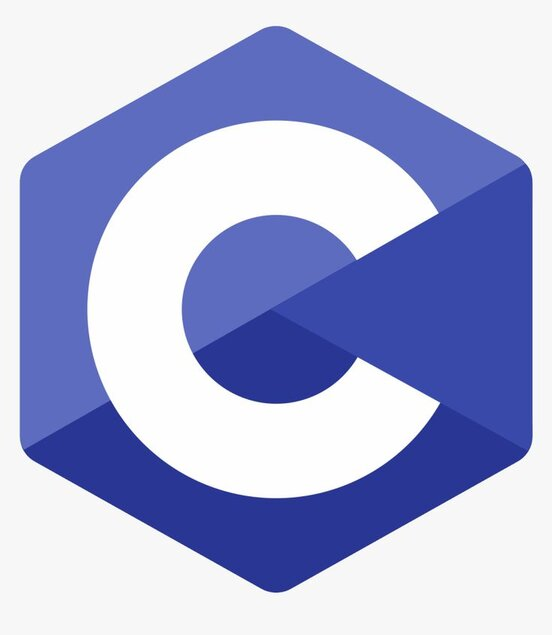

# About me.
  <strong>Hi I'm Johnmark 👋. Welcome to my GitHub.</strong>
 Hope you enjoy.
 
 How to reach me:
 - https://instagram.com/johnmarkmuhando/
- https://www.linkedin.com/in/johnmark-muhando-69a05b270/
<!-- # Skills.
-  -->

# Activities.
- 🔭 I’m currently working on frontend web developmment with React.

- 👯 I’m looking to collaborate on ...

<!--
**johnmark287/johnmark287** is a ✨ _special_ ✨ repository because its `README.md` (this file) appears on your GitHub profile.

Here are some ideas to get you started:

- 🌱 I’m currently learning ...
- 🤔 I’m looking for help with ...
- 💬 Ask me about ...
- 📫 How to reach me: ...
- 😄 Pronouns: ...
- ⚡ Fun fact: ...
-->
